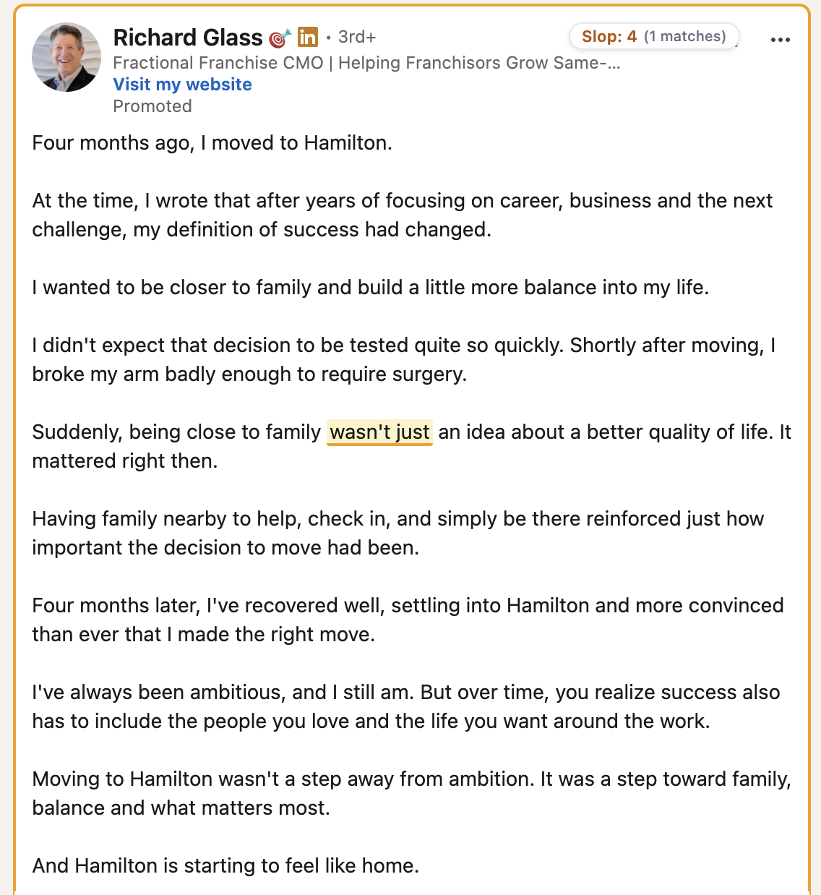
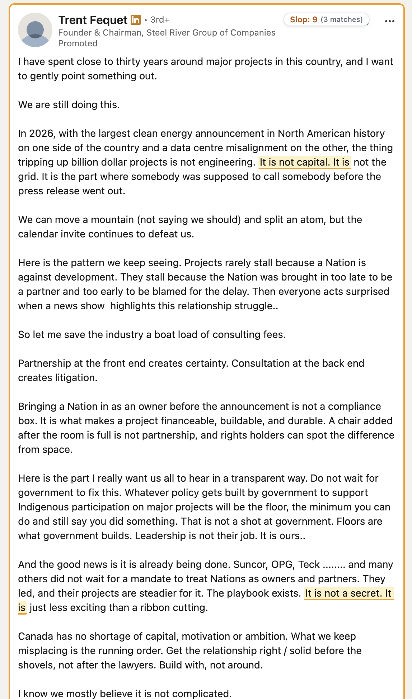

# LinkedIn Slop Detector

[](https://github.com/Pragith/linkedin-slop-detector/actions/workflows/ci.yml)
[](LICENSE)
[](https://developer.chrome.com/docs/extensions/develop/migrate/what-is-mv3)

LinkedIn Slop Detector is a privacy-first, open-source browser extension that finds formulaic writing clichés and stylistic slop in LinkedIn posts. It supports Google Chrome, Mozilla Firefox, Microsoft Edge, and Brave with Manifest V3.

It does not claim to identify who or what wrote a post. Matches are transparent stylistic evidence produced by deterministic, configurable rules.

## Note from the author

Doom scrolling was already bad enough. Now I have to doom scroll through “here’s the thing,” “at its core,” “not only X but Y,” “delve,” “pivotal,” and other recycled AI filler just to find something worth reading.

If you’re a victim of AI slop, you deserve this add-on. If you’re creating AI slop, you probably deserve to be muted.

It can highlight, outline, dim, collapse, or completely hide sloppy posts. Every rule is configurable, and you can add your own.

False positives? Oops. It’s LinkedIn. I’ll survive. Hopefully fewer impressions and less engagement become a wake-up call for people mass-producing this stuff.

Use AI. Just have something to say.

— Pragith Prakash

GitHub: [Pragith/linkedin-slop-detector](https://github.com/Pragith/linkedin-slop-detector)

## What it does

- Evaluates post body text with 61 built-in rule families covering contrast templates, canned hooks, faux insights, inflated language, weak vocabulary signals, and structural repetition.
- Scores matches instead of making a binary “AI-generated” claim.
- Highlights exact phrases and can outline, dim, collapse, or hide posts that meet your thresholds.
- Lets you enable, disable, edit, remove, restore, duplicate, and test rules. Custom rules support full CRUD.
- Keeps detection and configuration entirely on-device with no telemetry or external detection service.
- Handles initial load, infinite scrolling, expanded posts, text updates, and recycled LinkedIn feed nodes incrementally.

## Screenshots

### Detection in the LinkedIn feed

| Highlighted match and score badge                                                                                             | Multiple contrast-pattern matches                                                                                       |
| ----------------------------------------------------------------------------------------------------------------------------- | ----------------------------------------------------------------------------------------------------------------------- |
|  |  |

### Explainable pattern breakdowns

| Multiple rule families                                                                                                        | Strong template matches                                                                                                | Density and vocabulary signals                                                                                               |
| ----------------------------------------------------------------------------------------------------------------------------- | ---------------------------------------------------------------------------------------------------------------------- | ---------------------------------------------------------------------------------------------------------------------------- |
|  |  |  |

The extension highlights exact evidence and shows how each rule contributed to the score. It does not claim that a post was written by AI.

## Supported browsers

- Google Chrome, Manifest V3
- Mozilla Firefox, Manifest V3
- Microsoft Edge, Manifest V3
- Brave, using the Chromium Manifest V3 build

The Brave archive intentionally contains the same signed-off Chromium build as Chrome, under a browser-specific release filename.

## Installation

### GitHub release archives

1. Download the archive for your browser from [GitHub Releases](https://github.com/Pragith/linkedin-slop-detector/releases).
2. Extract the archive.
3. In Chrome, open `chrome://extensions`; in Brave, open `brave://extensions`; in Edge, open `edge://extensions`.
4. Enable Developer mode, choose Load unpacked, and select the extracted directory.
5. In Firefox, open `about:debugging#/runtime/this-firefox`, choose Load Temporary Add-on, and select the extracted `manifest.json`. Permanent Firefox installation requires a Mozilla-signed package.

### Local development

Requirements: Node.js 22 or newer and npm 10 or newer.

```bash
git clone https://github.com/Pragith/linkedin-slop-detector.git
cd linkedin-slop-detector
npm ci

npm run dev
npm run dev:firefox
```

## Testing and building

```bash
npm run compile
npm run lint
npm run format:check
npm test
npm run version:check
npm run build:all
npm run zip:all
```

`npm run build:all` produces unpacked Chrome, Firefox, Edge, and Brave targets. `npm run zip:all` produces browser-specific release archives and `SHA256SUMS.txt`.

## How detection works

1. The LinkedIn adapter extracts only post body text and ignores author metadata, controls, comments, timestamps, and accessibility-only labels.
2. Length-preserving normalization standardizes Unicode quotes and whitespace while retaining exact source offsets.
3. Cached regular expressions produce deterministic matches. Custom patterns are syntax-checked, complexity-checked, length-limited, and capped by rule count and scan length.
4. Weighted matches contribute to a score. Density rules contribute only after their configured repetition threshold when density scoring is enabled.
5. A diversity bonus can apply when enough independent categories occur within a 250-word window.
6. Global score, match-count, and category-count thresholds determine whether configured post actions run.

See [Detection](docs/DETECTION.md), [Rules](docs/RULES.md), and [Scoring](docs/SCORING.md) for details.

## Privacy and permissions

The extension requests only:

- `storage`, to save settings, built-in overrides, and custom rules locally.
- `*://*.linkedin.com/*`, to run the content script on LinkedIn and inspect post body text.

No LinkedIn text leaves the browser. There is no analytics SDK, tracking pixel, remote rule service, account system, or LLM call. See [PRIVACY.md](PRIVACY.md).

## Adding custom rules

Open Settings, choose Rules Repository, and select Create Rule. Each rule stores plain regex source and flags, never a live `RegExp`. The editor validates the pattern and provides a live sandbox before you use it on the feed.

## Contributing

Community contributions are welcome. Read [CONTRIBUTING.md](CONTRIBUTING.md) and [CODE_OF_CONDUCT.md](CODE_OF_CONDUCT.md). New rule proposals must include positive examples, counterexamples, weight, severity, rationale, and false-positive considerations using the [rule proposal template](.github/ISSUE_TEMPLATE/new_slop_rule.yml).

## Roadmap

The next minor release is planned to add opt-in slop detection and filtering for LinkedIn comments, with separate controls and conservative defaults. See [docs/ROADMAP.md](docs/ROADMAP.md) for the acceptance criteria and later possibilities.

## Releases

Conventional Commits drive release-please. Merging a release PR creates a SemVer tag and GitHub release; the release workflow builds the tagged source, verifies versions, packages each browser, generates SHA-256 checksums, and attaches the artifacts. See [docs/RELEASES.md](docs/RELEASES.md).

## License

MIT License. Copyright (c) 2026 Pragith Prakash. See [LICENSE](LICENSE).
